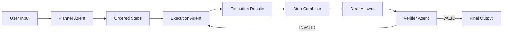

# 🧠 Planner–Executor–Verifier Agent

A clean, modular, production-quality Python project demonstrating a multi-stage intelligent agent architecture using OpenAI's GPT-4o-mini and Gradio.

## 🚀 Overview

The **Planner–Executor–Verifier (PEV)** pattern is a powerful multi-stage reasoning pipeline designed to reduce hallucinations and improve the reliability of AI outputs. Instead of generating a response in a single pass, the system:
1.  **Plans**: Decomposes a complex task into discrete, actionable steps.
2.  **Executes**: Performs each step sequentially, gathering results.
3.  **Verifies**: Critically assesses the final result for correctness, completeness, and consistency.
4.  **Refines**: Automatically iterates if the verification phase detects errors.

## 🏗️ Architecture



## 📝 Project Structure

```text
planner_executor_verifier/
│
├── agent.py            # Core PEV orchestration logic
├── app.py              # Gradio Web Interface
├── config.yaml         # LLM & Pipeline configurations
├── README.md           # Documentation
├── .env.example        # Environment variables template
├── requirements.txt    # Python dependencies
│
├── prompts/            # Externalized system prompts
│   ├── planner.txt
│   ├── executor.txt
│   └── verifier.txt
│
└── shared/             # Modular utility layers
    ├── llm.py          # OpenAI SDK wrapper with retries
    ├── base_agent.py   # Standard agent foundation
    ├── logger.py       # Reasoning trace logging
    └── utils.py        # File and config helpers
```

## 🧪 Example

**Input**: "Write a business plan for a local bakery."

**Plan**:
1.  Define the bakery's concept and target market.
2.  Outline the menu and product offerings.
3.  Establish an initial marketing strategy.

**Execution**:
- *Step 1 Result*: "Concept: 'Sourdough & Soul' focusing on organic artisan breads in downtown Portland..."
- *Step 2 Result*: "Menu: Standard loaves, specialty pastries, and seasonal tarts..."

**Verification**:
Checks if the plan covers finances, marketing, and operations. If missing, it triggers a refinement loop.

## 🎓 Learning Objectives

- **Multi-Agent Pipelines**: Learn how to chain specialized agents together.
- **Hallucination Reduction**: Using verification steps to catch logical errors.
- **Structured Reasoning**: Breaking down complex goals into manageable tasks.
- **Recursive Improvement**: Implementing feedback loops for self-correcting agents.

## 🛠️ Setup

1.  **Clone the repository**.
2.  **Install dependencies**:
    ```bash
    pip install -r requirements.txt
    ```
3.  **Configure Environment**:
    - Rename `.env.example` to `.env`.
    - Add your `OPENAI_API_KEY`.
4.  **Run the Application**:
    ```bash
    python app.py
    ```
