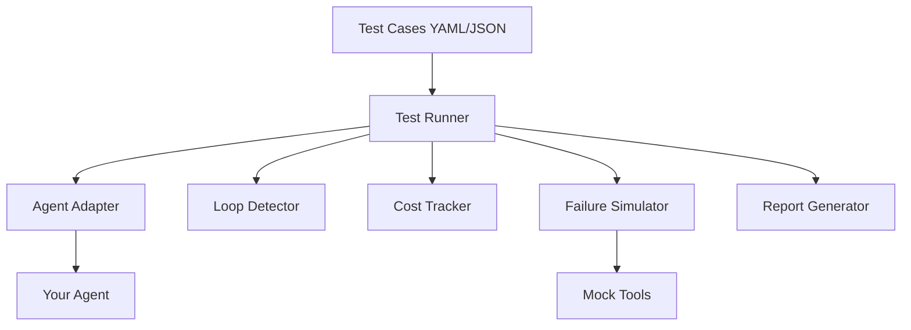

# 🛡️ Agent Testing Harness

A clean, modular, production-quality Python framework for testing AI agents. This harness provides tools for reliability engineering, validation, and production readiness.

## 🚀 Overview

The **Agent Testing Harness** allows you to run structured test cases against any agent system. It simulates real-world conditions like tool failures and detects common failure modes like infinite loops.

## 🏗️ Architecture



## 🛠️ Features

- **Unit Testing**: Run discrete prompts and validate outputs.
- **Mock Tools**: Standardized interfaces for search, calculation, and weather.
- **Failure Simulation**: Inject random failures, timeouts, and latency into tools.
- **Loop Detection**: Catch agents stuck in repetitive action cycles.
- **Cost Auditing**: Track token usage and estimate total execution cost.

## 📁 Project Structure

- `harness/`: Core logic (Runner, Loop Detector, etc.)
- `agent_adapters/`: Standardized wrappers for agents.
- `shared/`: Utilities and logging.
- `tests/`: Sample test definitions.
- `reports/`: Generated test results.

## 🏁 Getting Started

1. Install dependencies:
   ```bash
   pip install -r requirements.txt
   ```

2. Run the UI:
   ```bash
   python app.py
   ```

3. Upload `tests/sample_tests.yaml` in the web interface to see the results.

## 🧠 Learning Objectives

- Understanding **Reliability Engineering** for AI.
- Implementing **Defensive Programming** in agent loops.
- Designing **Generic Adapters** for tool-calling systems.
