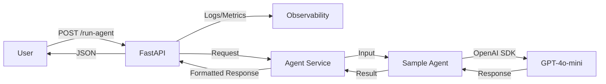

# Dockerized Agent API

A clean, modular, production-quality REST microservice that wraps an AI agent (GPT-4o-mini) using FastAPI and Docker.

## 🚀 Overview

This project provides a robust API wrapper around an AI agent. It includes:
- **FastAPI**: For high-performance async REST endpoints.
- **OpenAI SDK**: Integration with `gpt-4o-mini`.
- **Structured Logging**: Automatic tracking of request IDs, timing, and errors.
- **Observability**: In-memory metrics for latency and error tracking.
- **Dockerized**: Fully containerized and ready for deployment.

## 🏗️ Architecture



## 🛠️ Setup & Installation

### 1. Prerequisites
- Docker & Docker Compose
- OpenAI API Key

### 2. Configuration
Create a `.env` file from the example:
```bash
cp .env.example .env
```
Edit `.env` and add your `OPENAI_API_KEY`.

### 3. Build & Run
Using Docker Compose:
```bash
docker-compose up --build
```

The API will be available at `http://localhost:8000`.

## 📖 API Documentation

### POST `/run-agent`
Interact with the AI agent.

**Request Body:**
```json
{
  "input": "How does a bicycle work?"
}
```

**Response Body:**
```json
{
  "response": "...",
  "logs": "[INPUT]\n...\n[RESPONSE]\n...\n[TIME TAKEN]\n...",
  "metadata": {
    "request_id": "...",
    "timestamp": "...",
    "execution_time": "..."
  }
}
```

### GET `/health`
Check service status and metrics.

**Response Body:**
```json
{
  "status": "ok",
  "metrics": {
    "total_requests": 0,
    "total_errors": 0,
    "avg_latency_seconds": 0,
    "error_rate": "0%"
  }
}
```

## 📂 Project Structure

```text
dockerized_agent_api/
├── app/
│   ├── main.py          # Entry point
│   ├── api/             # Routes and Schemas
│   ├── agents/          # Agent Logic
│   ├── services/       # Service Layer
│   ├── core/            # Config, Logger, Monitoring
│   └── utils/           # Helpers
├── Dockerfile           # Container config
├── docker-compose.yml   # Orchestration
├── requirements.txt     # Dependencies
├── config.yaml          # Model settings
└── README.md            # Documentation
```
