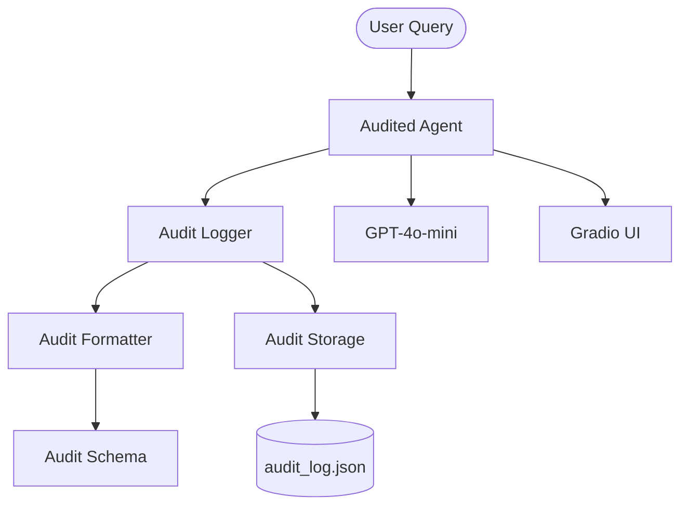

# 🕵️‍♂️ Audit-Trail Agent Pipeline

A production-quality AI agent system designed with **observability** at its core. Every internal step—thoughts, actions, tool usage, and decisions—is captured in a structured, persistent JSON audit trail.

## 🚀 Overview

The Audit-Trail Agent Pipeline demonstrates how to build "explainable" agents. By logging every transition in the agentic loop, developers can debug failures, audit for compliance, and provide users with a transparent view of how an AI arrived at its conclusion.

## 🏗️ Architecture



1.  **Agent**: Orchestrates the reasoning loop.
2.  **Logger**: Captures discrete events (thoughts, actions).
3.  **Formatter**: Normalizes events into a consistent JSON schema.
4.  **Storage**: Persists events to disk.
5.  **UI**: Provides a real-time monitoring dashboard.

## 🛠️ Features

- **Structured Logging**: Every step follows a strict Pydantic-validated schema.
- **Traceability**: Unique `trace_id` links all steps of a single request.
- **Persistent Storage**: Logs are saved to `logs/audit_log.json` for long-term analysis.
- **Token Tracking**: Records token usage for every LLM call.
- **Interactive UI**: Live visualization of the "thought process" alongside the final answer.

## 📋 Example Trace

**Input**: "What is 25 * 4?"

**Audit Log snippet**:
```json
[
    {
        "trace_id": "...",
        "step_type": "thought",
        "content": "Analyzing user query... I need a tool for calculation."
    },
    {
        "trace_id": "...",
        "step_type": "action",
        "tool": "calculator",
        "content": "Executing tool: calculator",
        "metadata": {"args": "25 * 4"}
    },
    {
        "trace_id": "...",
        "step_type": "observation",
        "content": "Tool result: 100"
    }
]
```

## 🎓 Learning Objectives

- **Observability**: Understand why the agent did what it did.
- **Debugging**: Troubleshoot hallucination or tool failures easily.
- **Compliance**: Maintain a permanent record of AI-driven decisions.

## 🚦 Getting Started

1.  Install dependencies: `pip install -r requirements.txt`
2.  Configure environment: Copy `.env.example` to `.env` and add your `OPENAI_API_KEY`.
3.  Run the UI: `python app.py`
