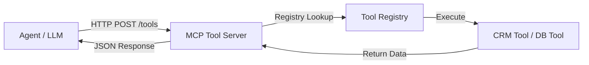

# MCP Tool Server (Model Context Protocol Server)

A clean, modular, production-quality system that exposes business tools to MCP-compatible agents using FastAPI.

## 🚀 Overview

The **Model Context Protocol (MCP)** is a standardized way for AI agents to discover and interact with external tools and data sources. This server acts as a gateway, exposing internal business logic (like CRM lookups and database queries) via a secure, schema-documented API.

### 🏗 Architecture



## 🛠 Features

- **MCP-Style Definitions**: Uses `input_schema` (JSON Schema) for tool discovery.
- **Modular Registry**: Easily add new tools by registering them in `tool_registry.py`.
- **Structured Logging**: Detailed logs of tool calls, parameters, and execution time.
- **Secure**: Simple API Key authentication via `X-API-Key` header.
- **Docker Ready**: Includes `Dockerfile` and `docker-compose.yml` for instant deployment.

## 📂 Project Structure

```text
mcp_tool_server/
├── app/
│   ├── main.py          # App initialization
│   ├── api/             # Routes and Pydantic schemas
│   ├── tools/           # Tool implementations & registry
│   ├── core/            # Config, Auth, and Logger
│   └── services/        # Business logic (ToolService)
├── tests/               # Integration tests
├── Dockerfile           # Container build spec
├── docker-compose.yml   # Orchestration
├── requirements.txt     # Dependencies
└── .env.example         # Template for environment variables
```

## 🚦 Quick Start

### 1. Local Setup
```bash
# Install dependencies
pip install -r requirements.txt

# Create .env from example
cp .env.example .env

# Run the server
uvicorn app.main:app --reload
```

### 2. Docker Setup
```bash
docker-compose up --build
```

### 3. Running Tests
```bash
python tests/test_tools.py
```

## 📖 API Documentation

Once the server is running, visit:
- **Swagger UI**: [http://localhost:8000/docs](http://localhost:8000/docs)
- **Redoc**: [http://localhost:8000/redoc](http://localhost:8000/redoc)

### Example Tool Call

**Request**: `POST /api/v1/tools/get_customer_info`
```json
{
  "parameters": {
    "customer_id": "CUST-001"
  }
}
```

**Response**:
```json
{
  "result": {
    "name": "John Doe",
    "email": "john.doe@example.com",
    "account_status": "Active",
    "last_interaction": "2024-03-15"
  }
}
```

## 🎓 Learning Objectives

1. **Tool Interoperability**: How to structure tool schemas for LLM consumption.
2. **Platform Design**: Building a centralized service for multiple disparate tools.
3. **Enterprise Integration**: Implementing auth, logging, and containerization in agentic systems.
