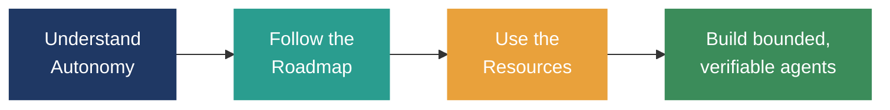
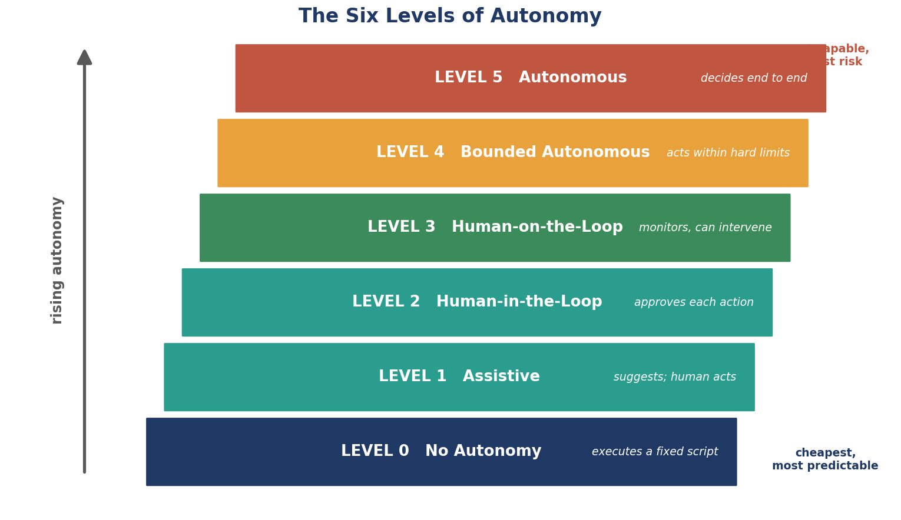
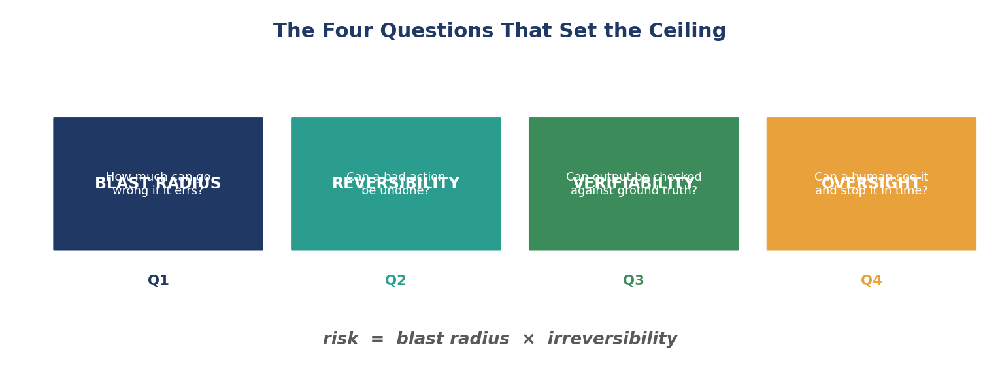
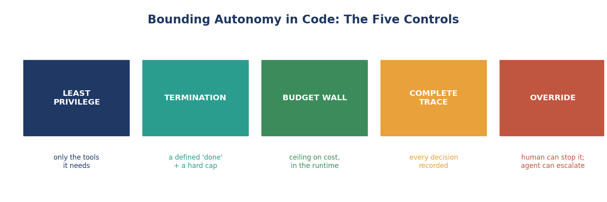
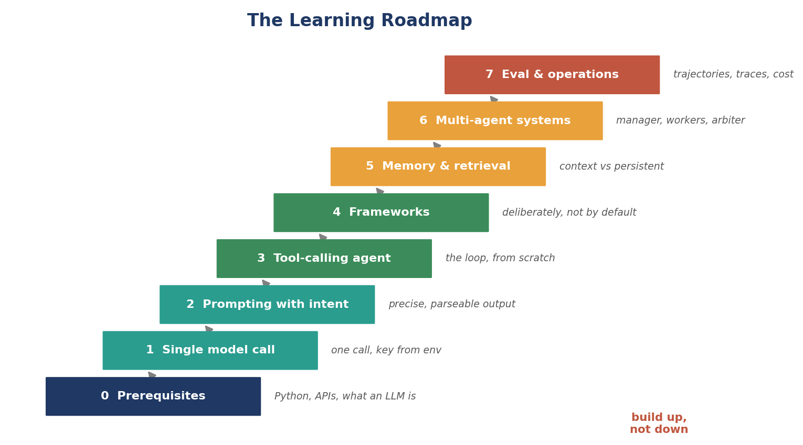
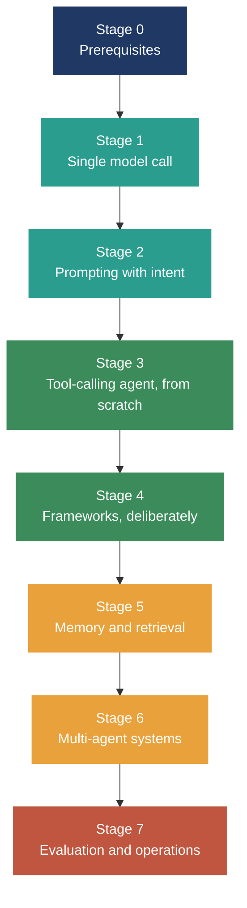
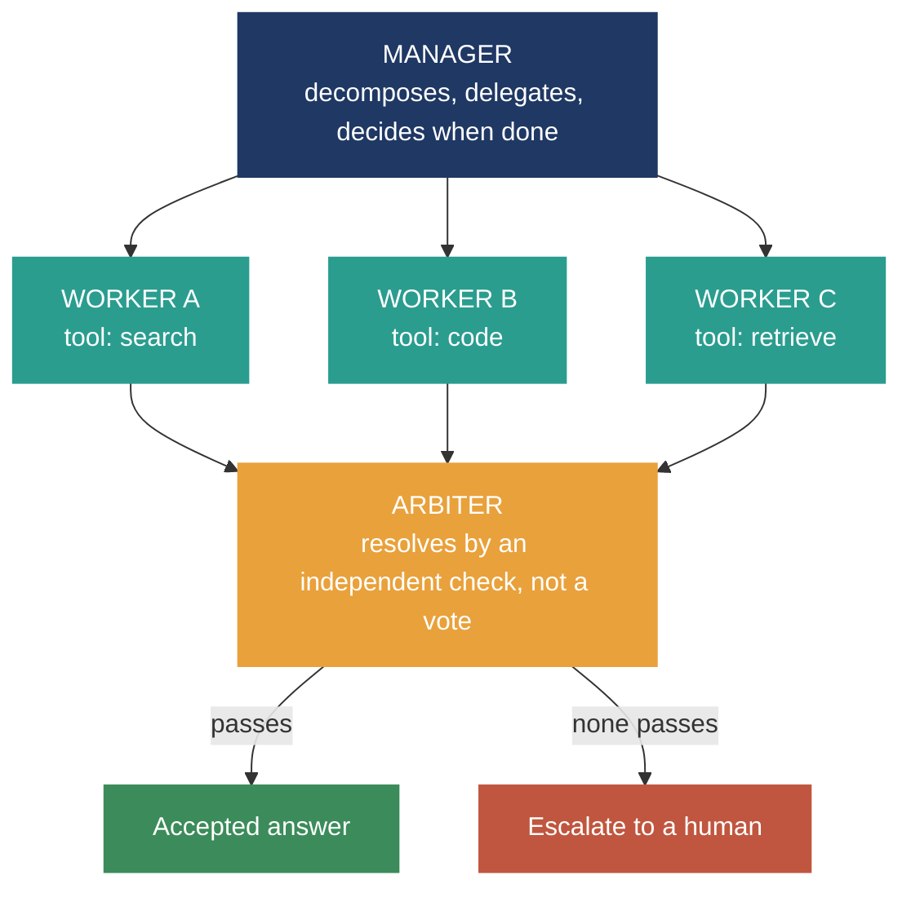

# Agentic AI: Autonomy, Learning Roadmap, and Resources

A companion guide for this repository. It sets out how to think about agent
autonomy, a staged path for learning to build agentic systems, and a curated
list of resources worth your time. The guiding principle throughout is the one
that runs through the whole field: use the least autonomy that solves the
problem, and raise it only when the task demands it and the checks are in place.

---

## Part 1: Understanding Autonomy

Autonomy is not a switch you flip. It is a dial you turn, deliberately, one
notch at a time, and it is something you grant to a system rather than something
the system possesses. Two ideas need separating before anything else.

**Autonomy is not capability.** A model can be enormously capable and granted
almost no autonomy, and a weak model can be handed far more autonomy than it
deserves. Capability is how well a system reasons, plans, and uses tools.
Autonomy is how much of that it is allowed to do without a human in the path. A
powerful model behind a human approval gate is a low-autonomy system, and that
is often exactly the right design. A weak model wired to act on its own is a
high-autonomy system, and it is usually a bad one.

**Autonomy has dimensions, not a single number.** Two systems can claim the
same "level" and differ enormously in risk, because what matters is the scope
of what they may touch, the reversibility of their actions, and whether a human
can see and stop them. Always ask what an agent can actually do, not what tier
it is labelled with.

### The Six Levels of Autonomy

A useful ladder, adapted from the driving-automation analogy and applied to
agents. Autonomy rises as you climb, and so does risk.

| Level | Name | What decides | Human role |
|-------|------|--------------|------------|
| 0 | No autonomy | Nothing; executes a fixed script | Human does everything the system does not |
| 1 | Assistive | The human, informed by the agent | Agent suggests; human acts |
| 2 | Human-in-the-loop | The agent proposes; the human approves each consequential action | Human approves before anything happens |
| 3 | Human-on-the-loop | The agent acts; the human monitors and can intervene | Human supervises and can override |
| 4 | Bounded autonomous | The agent acts freely within hard limits | Human sets the boundaries, reviews outcomes |
| 5 | Autonomous | The agent decides and acts end to end | Human sets goals and audits after the fact |

A few things the table cannot say on its own:

- **Level 0 is the correct answer far more often than the field admits.** If a
  deterministic script does the job, it will do it more cheaply, more
  predictably, and with a trace you can actually read. Reach for an agent only
  when the task genuinely needs one.
- **The level is chosen per step, not per system.** A single workflow can run a
  low-risk step at Level 4 and gate its one irreversible step at Level 2. Do
  not set one autonomy level for a whole system when its steps carry different
  risk.
- **Autonomy is earned, not granted by default.** Start a new agent low. Raise
  it only after it has proven itself at the level below, and only as far as the
  verification and override mechanisms can keep up.

### The Four Questions That Set the Ceiling

Before granting a level of autonomy, answer these:

1. **Blast radius.** How much can go wrong if the agent is wrong? An agent that
   drafts text and an agent that moves money are not in the same category.
2. **Reversibility.** Can a bad action be undone? Irreversible actions belong
   behind a human gate almost regardless of how capable the agent is.
3. **Verifiability.** Can the agent's output be checked against something
   outside its own reasoning: a test that runs, a source that corroborates, a
   computation that reconciles? Where nothing can check it, autonomy must stay
   low.
4. **Oversight.** Can a human see what the agent is doing and stop it in time?
   Autonomy without observability and an override is not autonomy, it is a
   system running unattended.

Risk, in one line, is **blast radius times irreversibility.** Size the autonomy
to the risk, and put the human exactly where the risk concentrates.

### Bounding Autonomy in Code

Whatever level you choose, the boundary belongs in the runtime, not in a
prompt. A boundary you request can be ignored; a boundary you enforce cannot.

Every agent in this repository should ship with:

- **Least privilege.** Each agent gets only the tools it needs, and each tool is
  safe when called with input the model chose, because it eventually will
  choose badly.
- **A termination condition.** An explicit definition of "done", plus a hard
  step or iteration cap. An agent loop without one is designed to run forever.
- **A budget wall.** A ceiling on tokens, tool calls, time, or cost, enforced in
  code. It is the difference between a bounded system and a surprise invoice.
- **A complete trace.** Every decision, tool call, and result, recorded. You
  cannot debug a decision you cannot see, and for anything multi-agent the trace
  is the only place the real behaviour exists.
- **An override.** A human must be able to take control, and the agent must be
  able to escalate to a human when it cannot verify its own answer.

---

## Part 2: A Learning Roadmap

A staged path from first principles to production systems. Each stage assumes
the one before it. Resist the urge to skip ahead; the failures at each stage are
the ones the next stage teaches you to prevent.

### Stage 0: Prerequisites

- Comfortable Python (functions, classes, dictionaries, exceptions, virtual
  environments).
- A working mental model of what a large language model is: a next-token
  predictor, not a database and not a reasoner with guaranteed correctness.
- Basic API literacy: making an authenticated request, reading a JSON response,
  handling an error.

If you are missing any of these, close this file and fix that first. The rest
will not stick otherwise.

### Stage 1: A single model call

- Set up an isolated environment and load an API key from the environment, never
  from source code.
- Make one model call. Read the response. Change the temperature and watch what
  happens. Set it to zero and confirm the output stabilises.
- **Milestone:** a script that takes a question and returns a model's answer,
  with the key kept out of version control.

### Stage 2: Prompting with intent

- Learn the difference between a vague instruction and a precise one. Ask for a
  specific output format and parse it.
- Practise system prompts that state a role, a format, and a stopping condition.
- **Milestone:** a prompt that reliably returns machine-readable output you can
  parse without the program crashing.

### Stage 3: A tool-calling agent, from scratch

- Build the loop by hand: a tool registry, a model call, a parse step, and a
  bounded loop that either calls a tool or finishes.
- Put the safety boundary inside each tool. Put a step cap and a tool budget in
  the loop from the first line.
- Thread a trace through it so you can see every decision.
- **Milestone:** an agent that uses one tool correctly, returns an answer, and
  always terminates, whether it succeeds, runs out of budget, or hits its cap.
- **Do this before touching any framework.** Every framework is a more elaborate
  version of this loop, and you will use them with your eyes open only if you
  have written the loop once yourself.

### Stage 4: Frameworks, deliberately

- Now pick up a framework and notice which parts of your hand-written loop it
  provides: the loop, the tool schema, the tracing, the retries.
- Read the underlying code. Incorrect assumptions about what a framework does
  under the hood are one of the most common sources of error.
- **Milestone:** rebuild your Stage 3 agent in a framework, and be able to point
  to where each mechanism you wrote by hand now lives.

### Stage 5: Memory and retrieval

- Distinguish the context window (working memory) from persistent memory.
- Add retrieval so the agent can pull a small, relevant slice of a large store
  rather than carrying everything in context.
- Learn where retrieval quietly fails: similarity is not relevance, indexes go
  stale, embeddings drift. Treat a retrieved memory as a claim to be checked,
  not a fact to be trusted.
- **Milestone:** an agent that answers from a document store and cites what it
  used.

### Stage 6: Multi-agent systems

- Compose agents into a manager-worker system with explicit message passing.
- Make the workers genuinely different (different tools, context, or objective),
  or accept that you have one agent's judgement repeated at several times the
  cost.
- Add loop detection, a shared budget, and termination conditions.
- Resolve conflict with an independent check, never a vote and never "most
  confident". Escalate to a human when nothing passes.
- **Milestone:** a multi-agent system that is measurably better than a single
  agent on a task that genuinely needs decomposition, and that always stops for
  a legible reason.

### Stage 7: Evaluation, observability, and operations

- Evaluate over whole trajectories on your own task, not single answers on a
  benchmark.
- Instrument everything: structured logs, traces, cost and latency per run.
- Handle the operational realities: retries, rate limits, cost control, and the
  question of what to do when an agent fails in production.
- **Milestone:** you can state, with evidence, whether your agent is good enough
  to ship, and you can debug it when it is not.

### A note on order

The single most common mistake is starting at Stage 4 or 6, importing a
framework or a multi-agent template before understanding the loop underneath it.
The result is a system that works on the examples its author tried and fails
everywhere else, with no trace to explain why. Build up, not down.

---

## Part 3: Resources

A short, curated list. Depth over breadth; every entry here is worth reading
properly rather than skimming. Newer material appears often, so treat this as a
starting point and follow the primary sources it points to.

### Foundational reading

- **Anthropic, "Building Effective Agents"** — the single best short essay on
  when to build an agent and when not to. Its core lesson, start simple and add
  complexity only when it earns its place, is the spine of this whole guide.
  https://www.anthropic.com/engineering/building-effective-agents
- **Anthropic, "Writing Effective Tools for Agents"** — practical, hard-won
  guidance on tool design, which is where most agent quality is won or lost.
  https://www.anthropic.com/engineering/writing-tools-for-agents
- **OpenAI API documentation** — the reference for function calling and
  structured outputs, the mechanisms most agent loops are built on.
  https://platform.openai.com/docs/

### Key papers (read the abstract and figures first, then decide)

- **ReAct: Synergizing Reasoning and Acting in Language Models** (Yao et al.,
  2023) — the reasoning-and-acting loop that most tool-using agents are a
  variant of. arXiv:2210.03629
- **Toolformer: Language Models Can Teach Themselves to Use Tools** (Schick et
  al., 2023) — how tool use is learned and invoked. arXiv:2302.04761
- **Chain-of-Thought Prompting Elicits Reasoning** (Wei et al., 2022) — the
  origin of step-by-step reasoning, and its limits. arXiv:2201.11903
- **Tree of Thoughts: Deliberate Problem Solving** (Yao et al., 2023) — search
  over branching reasoning paths, and when it is worth the cost.
  arXiv:2305.10601
- **Generative Agents: Interactive Simulacra of Human Behavior** (Park et al.,
  2023) — memory streams and genuine emergence in a multi-agent setting.
  arXiv:2304.03442
- **AutoGen: Multi-Agent Conversation** (Wu et al., 2023) — a widely used
  multi-agent framework and the ideas behind it. arXiv:2308.08155

### Frameworks worth knowing

Learn the mechanism first (Stage 3), then reach for these deliberately.

- **LangGraph** — stateful, graph-structured multi-agent applications.
  https://langchain-ai.github.io/langgraph/
- **AutoGen** — multi-agent conversation and orchestration.
  https://github.com/microsoft/autogen
- **CrewAI** — role-based agent teams. https://github.com/crewAIInc/crewAI

### Running open-weight models locally

For the data-residency and cost reasons that make local models mandatory rather
than optional in many settings:

- **Ollama** — the simplest way to run Llama, Qwen, and others locally, behind an
  OpenAI-compatible endpoint. https://github.com/ollama/ollama
- **vLLM** — high-throughput serving when you outgrow a single machine.
  https://github.com/vllm-project/vllm

### How to use this list

Do not read it all at once. Match the resource to the stage you are on: the
Anthropic essays at Stage 1, the tool-design piece at Stage 3, the multi-agent
papers and frameworks at Stage 6. A resource read before you have the problem it
solves is a resource you will forget.

---

## The One-Sentence Summary

Build the simplest thing that works, bound it in code rather than in a prompt,
verify its output against something outside the model's own confidence, and
raise its autonomy only when it has earned it.
